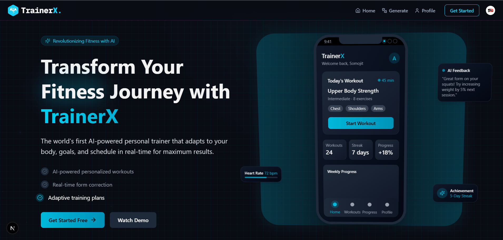

# 🏋️‍♂️ **TrainerX** – Your AI-Powered Fitness Companion

**TrainerX** is a cutting-edge fitness platform that uses AI to generate personalized workout and diet programs. Whether you’re starting out or deep into your fitness journey, TrainerX tailors every experience to you — all within a beautiful and modern UI.



---

## 🌐 **Live Demo**  
[Check out the live demo here!](https://trainerx.vercel.app/)

---

## ✨ Highlights

- 🚀 **Built with**: Next.js, React, Tailwind CSS & Shadcn UI  
- 🎙️ **Voice Assistant (Vapi) Integration**  
- 🧠 **AI-powered Recommendations via Gemini**  
- 🏋️ **Smart Exercise Plans Based on Your Needs**  
- 🥗 **AI-Curated Nutrition Suggestions**  
- 🔐 **Authentication & Access Control via Clerk**  
- 💾 **Real-Time Data Storage with Convex**  
- 🎬 **On-the-Fly Program Generation**  
- 💻 **Modular Layouts using Server & Client Components**  
- 📱 **Fully Responsive Design**  
- 📊 **Scalable Codebase Ready for Growth**

---

## 🛠️ Tech Stack

| Logo | Technology     | Description                                                |
|------|----------------|------------------------------------------------------------|
|  | **Next.js**        | React framework for frontend & server logic     |
|  | **React**          | Component-based library for dynamic UIs         |
|  | **Tailwind CSS**   | Utility-first CSS framework for fast styling     |
|  | **Shadcn UI**      | Beautiful, accessible UI components              |
|  | **Clerk**          | Authentication & user management                 |
|  | **Vapi**           | Conversational voice AI platform                 |
|  | **Convex**         | Real-time backend and serverless database        |
|  | **Gemini AI**      | LLM for generating personalized content          |

---

## 🌟 Key Features

- **AI Fitness Assistant** 🤖  
  Engage in intelligent conversations with a voice-enabled AI to set fitness goals and build your fitness profile.

- **Customized Workout Plans** 🏋️‍♂️  
  Dynamic plans built to suit your training level, past injuries, and fitness ambitions.

- **Personalized Diet Programs** 🍎  
  Get tailored meal suggestions that match your taste, allergies, and health requirements.

- **Secure & Flexible Authentication** 🔒  
  Sign in using GitHub, Google, or email/password — all backed by Clerk’s secure auth system.

- **Smart Program Management** 📊  
  Keep track of all your fitness programs. Only the latest one stays active — just like a real fitness schedule.

- **Real-Time Experience** ⏱️  
  Built on Convex, all data updates are instant — from program changes to AI conversations.

- **Accessible Anywhere** 🌍  
  Designed to shine across all screen sizes — mobile, tablet, or desktop.

- **Clean Architecture** 🏗️  
  Built with reusable components, server actions, and API routes to ensure maintainability.

---

## 📚 Documentation Links

- [Next.js Documentation](https://nextjs.org/docs)  
- [Clerk Docs](https://clerk.dev/docs)  
- [Vapi Docs](https://docs.vapi.ai)  
- [Convex Docs](https://docs.convex.dev)  
- [Gemini AI Docs](https://deepmind.google/technologies/gemini/)

---

## 🧠 Learnings

This project was a deep dive into:

- Voice-driven user interfaces 🎤  
- Modern full-stack architecture with server actions 🔄  
- Realtime reactive data flows ⚡  
- Authentication and session management best practices 🔑  
- AI-driven personalization strategies 🤖  

---

## 💬 **Contributing 🌍**

We welcome all contributions! Here's how you can contribute:

1. 🍴 Fork the repository.
2. 🌿 Create a new branch:
    ```bash
    git checkout -b feature-branch
    ```
3. 🖊️ Commit your changes:
    ```bash
    git commit -m "Add your feature"
    ```
4. 🚀 Push the branch:
    ```bash
    git push origin feature-branch
    ```
5. 🔀 Open a pull request.

---

## 📧 **Contact ✉️**

For any questions or feedback, feel free to contact me:

- 📧 Email: [soumojitbanerjee22@gmail.com](mailto:soumojitbanerjee22@gmail.com)

---

## 👨‍💻 **Made by [Soumojit Banerjee](https://www.linkedin.com/in/soumojit-banerjee-4914b3228/)** 💼

Feel free to connect with me on:  
🔗 [**LinkedIn**](https://www.linkedin.com/in/soumojit-banerjee-4914b3228/)  

---

## ❤️ **Special Thanks 🙏**

A special thanks to **ChatGPT** for all your support in completing this project! 🌟

---

> Enjoy using **TrainerX.**? Show some love by giving it a ⭐ on GitHub!

